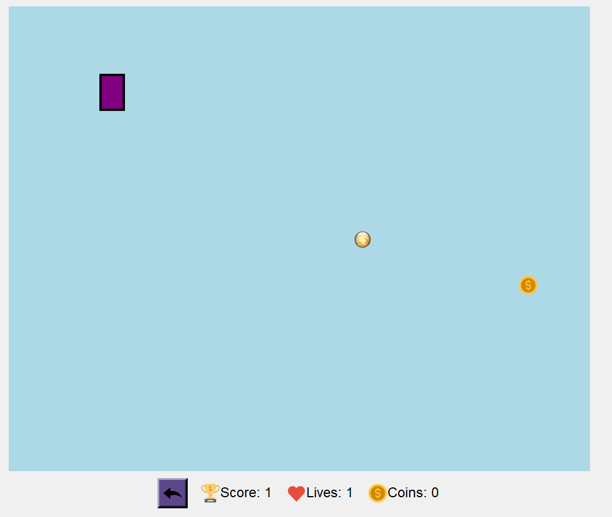
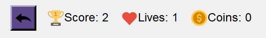
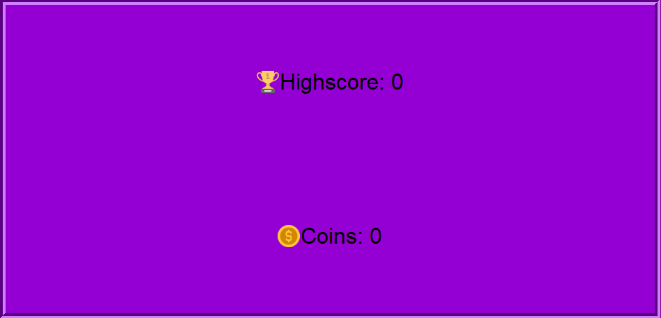
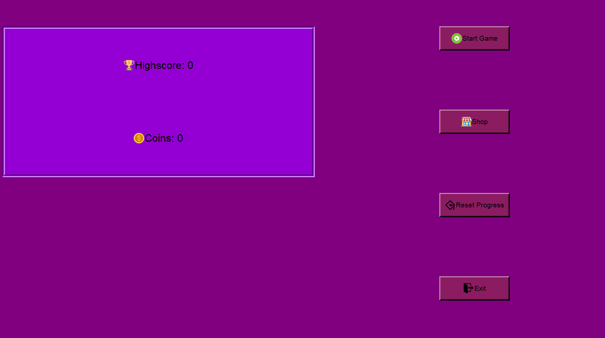
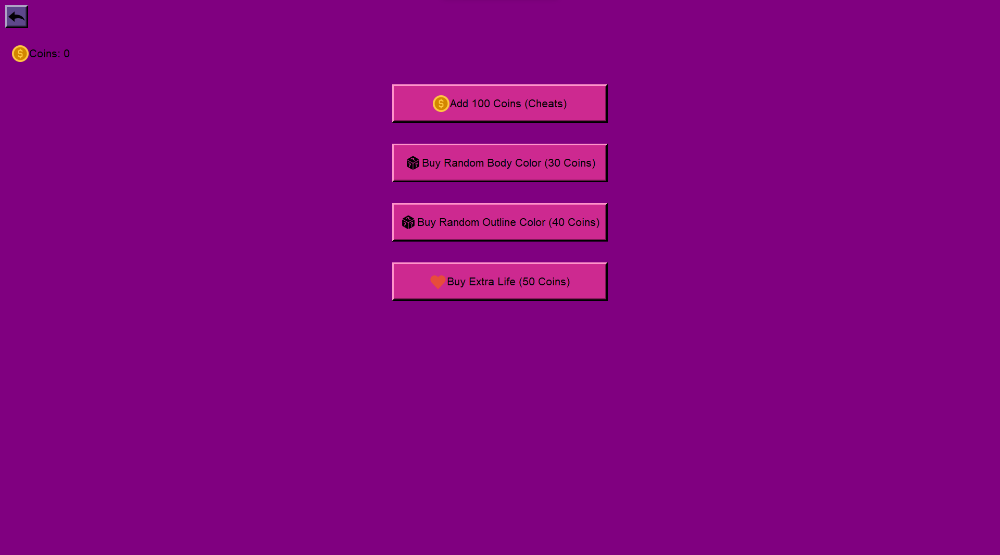
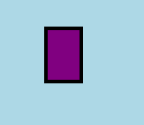
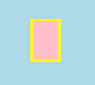
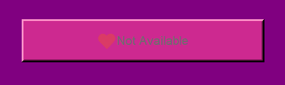

# Chicken-Universe
**Description:** You're a trained rectangle :black_square_button: sent into space to collect coins  :money_with_wings:. Dodge space debris and planets :earth_asia:, and collect as many coins :moneybag: as you can! Compete with friends :busts_in_silhouette: and improve your personal record. :trophy: :sunglasses:
___
## Gameplay:
Dodge obstacles and collect coins! Beat your best record.

**Controls:**
+ Up arrow - move the player upwards
+ Down arrow - move the player downwards

**Information:**

The panel holds information about the current score, coins, and lives. Initially, the player starts with 1 life, but with the help of coins, extra lives can be purchased (up to a maximum of 3).

## Main Menu:
The main menu stores player statistics. 

and offers options to:
+ Start the game
+ Exit
+ Enter the shop
+ Reset progress

## Shop
The shop... we all know what it's for! It has 4 buttons:

+ Cheat button: gives 100 coins with each press.
+ Purchase random body color or random outline color.

  
+ Buy an extra life: (Sneaky folks might think they can buy lives endlessly, but I regret to inform them that after purchasing 3 lives, buying an extra life is no longer possible.)

